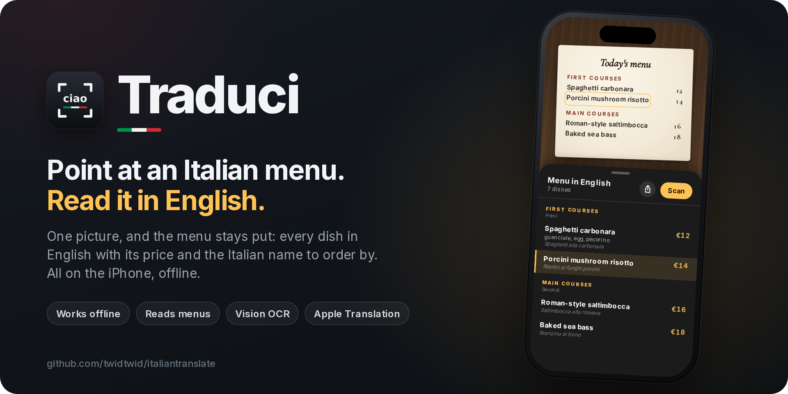
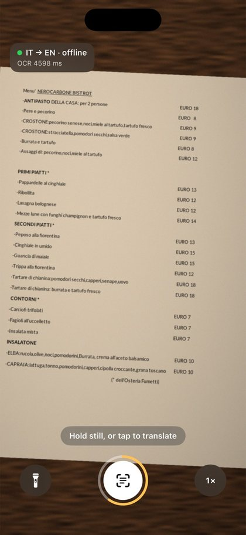
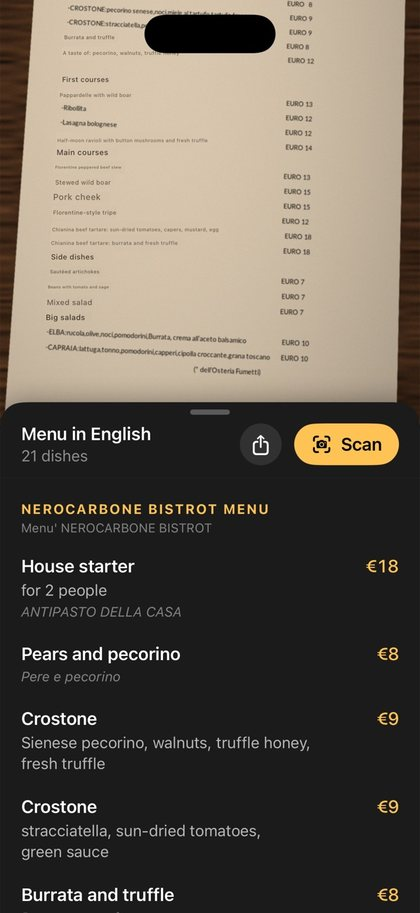
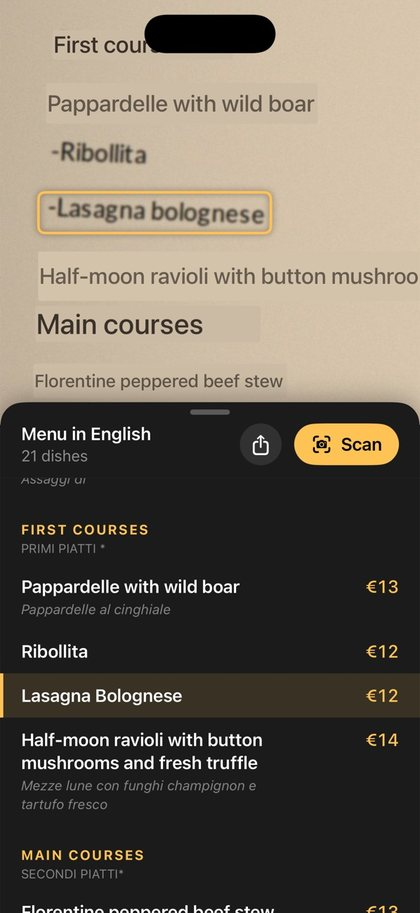

<p align="center">
  
</p>

<p align="center">
  <a href="https://github.com/twidtwid/italiantranslate/actions/workflows/ios.yml"></a>
  
  
  <a href="LICENSE"></a>
</p>

# Traduci

Point your iPhone at an Italian menu or sign and read it in English. Traduci opens straight into the camera. Hold still over the text (or tap) and it takes the picture, then gives you the page in English: every dish in a list you can read at the table, with its price and the Italian name to order by, and the English painted over the photo.

- **Fully offline.** Apple's Vision reads the text and Apple's Translation framework translates it, both on the device. After a one-time download of the Italian language pack, it works in airplane mode.
- **Built for speed.** OCR always runs on the newest camera frame and never works through a backlog. While you aim, the text nearest the centre is translated ahead, so most of the page is already in English when the picture is taken. Every result is cached, and the translation model is loaded before the first text shows up.
- **Reads menus like a diner.** It works out which lines are one dish, which are its ingredients and allergens, which price goes with it (in a price column, under a centred dish, or at the end of the ingredients), where the sections start, and which way the columns go. English that the menu already prints is left alone.
- **Stays put.** The picture stays until you tap **Scan**: put the phone down, pass it across the table, it's still there.

<p align="center">
  
  &nbsp;
  
  &nbsp;
  
</p>
<p align="center"><sub>Aiming, reading, and finding a dish on the photo. Screenshots from the menu lab's Simulator run: the Simulator has no translation models, so the English there is canned.</sub></p>

## Install with TestFlight (no Mac)

GitHub's Mac runners build the app, Apple's cloud signing signs it, and it's uploaded to TestFlight. The setup is one-time and happens in a browser; a phone is fine.

1. **API key.** In App Store Connect, go to **Users and Access → Integrations → App Store Connect API → Team Keys → +** and pick the role **Admin**, which cloud signing needs. If you see **Request Access**, do that first. Download the `.p8` (Apple only lets you do this once) and note the **Key ID** and **Issuer ID**.
2. **Team ID.** It's under **Membership details** at [developer.apple.com/account](https://developer.apple.com/account).
3. **GitHub secrets.** In this repo, go to **Settings → Secrets and variables → Actions → New repository secret** and add:
   - `ASC_KEY_ID`
   - `ASC_ISSUER_ID`
   - `APPLE_TEAM_ID`
   - `ASC_PRIVATE_KEY`: the whole `.p8` file, including the `BEGIN`/`END` lines.

   Put the key straight into GitHub; don't paste it anywhere else.
4. **Run the TestFlight workflow.** It runs by itself on every push that changes the app, on `main` or this branch. To run it by hand, open the latest **TestFlight** run in **Actions** and choose **Re-run all jobs**, or use **Actions → TestFlight → Run workflow** once this code is on `main`. The first run registers the bundle ID `com.twidtwid.Traduci`, then stops and asks for the app record, which Apple only allows creating on the web. In App Store Connect, go to **Apps → + → New App**, choose iOS, and give it any unique name, e.g. "Traduci Live" (the home-screen name stays "Traduci"). Pick that bundle ID and any SKU. Run the workflow again and it archives, signs and uploads in about 5 minutes.
5. **TestFlight.** In App Store Connect, open your app, then **TestFlight → Internal Testing → +**. Add yourself and turn on automatic distribution. Install the TestFlight app on the iPhone. Each build appears there 5 to 15 minutes after upload, and builds last 90 days.

To use a different bundle ID, set a repository **variable** named `BUNDLE_ID`.

Then **do the first launch while you're online**: allow camera access and tap **Download** when iOS offers the Italian pack. The status pill turns green with `IT → EN · offline` once everything is local.

## Install from Xcode

You need a Mac with Xcode 26 or newer. An iPhone on iOS 27 needs Xcode 27.

1. Clone this repo and open `Traduci.xcodeproj`.
2. In Xcode, click the **Traduci** target, open **Signing & Capabilities**, and pick your Team. A free Apple ID works, but apps signed that way expire after 7 days; just run it again from Xcode.
3. If Xcode says the bundle ID is taken, change it to anything unique, e.g. `com.yourname.traduci`.
4. On the iPhone, turn on **Settings → Privacy & Security → Developer Mode**. Plug the phone in, select it in Xcode, and press ⌘R.
5. **Do the first launch while you're online.** Allow camera access, then tap **Download** when iOS offers the Italian pack. The status pill turns green with `IT → EN · offline` once everything is local.

The shared scheme runs the **Release** build, so the phone gets the optimised binary.

## Using it

**Point, hold, read.**
- **Point** at the menu. While you hold still over text, the ring around the shutter fills, then the picture is taken. Tap the shutter to take it straight away.
- **Read.** The photo stays on screen with the English painted over the Italian. Below it is the menu in English: the sections, each dish with what's in it, its price, and the Italian name to order by. A sign or a plaque comes out as plain paragraphs, each translated whole.
- **Scan** goes back to the camera for the next page.

| | |
|---|---|
| Drag the panel's top edge | A peek at the photo, half and half, or the whole list |
| Tap a dish in the list | Find it on the photo: it's outlined and brought into view |
| Tap a dish on the photo | Find it in the list |
| Pinch the photo | Small print; drag to look around |
| Share | The whole page as text, English with the Italian names and prices |
| Flashlight | Torch, for dark restaurants |
| Pinch while aiming / `1×` button | Camera zoom. The button cycles 1× → 2× → 5× (telephoto) |
| Top-left pill | Status, plus the latest OCR and translation (MT) times in ms |

- The phone switches to the ultra-wide lens by itself for close-up (macro) text.
- In a moving car or on a walk, the camera shortens its exposures while the phone shakes, and the picture is the sharpest of the last few frames, not just the last.
- If the camera stops (a call, another app, the phone too warm in the sun), the app says so instead of waiting. With no text in view for a while, or in Low Power Mode, it reads the camera less often.
- Hold it upright: the app is portrait-only, so text shot with the phone sideways isn't read.

## How it works

```
aiming:   camera ─► Vision OCR, newest frame only ─► menu reader ─► translate ahead, centre first (cached)
capture:  hold still or tap ─► freeze the recent frame that read best ─► list what it read at once (mostly
          translated already) ─► OCR it again in two overlapping bands (Vision reads at a fixed working size,
          so a band is a closer look: small prices come out; lines a band's edge cuts through are left to
          the other band) ─► menu reader ─► the list, and English painted over the photo in the page's own
          paper and ink colours, running on into the blank paper beside the Italian
menu reader: level the page ─► glue split lines ─► prices ─► dish / description / allergens / heading ─►
             columns in reading order ─► the menu's own English set aside; running text (a plaque, a
             notice) is read again as whole paragraphs
```

| File | Role |
|---|---|
| `Traduci/CameraController.swift` | Capture session, frame dropping, freeze and close read, torch, zoom |
| `Traduci/TextRecognizer.swift` | Vision OCR settings, and reading an image in bands |
| `Traduci/TranslationEngine.swift` | On-device translation queue, cache, warm-up, self-healing session |
| `Traduci/AppModel.swift`, `Traduci/MotionMonitor.swift` | Point, hold, read: auto-capture, focus, the picture's zoom and pan |
| `Traduci/ContentView.swift`, `Traduci/ReadingViews.swift` | The camera screen; the photo and the English list |
| `Traduci/Core/MenuReader.swift` | Reads OCR lines as a menu: dishes, descriptions, prices, sections, columns |
| `Traduci/Core/` | The rest of the camera-free logic: language detection, page colours, screen mapping |
| `Tests/CoreTests/` | Tests for `Core/`, including real OCR of real menus (`Fixtures/`), run by CI |
| `Tests/Lab/`, `.github/workflows/lab.yml` | The menu lab, below |
| `.github/workflows/ios.yml` | Every push: core tests plus an iOS build with Xcode 26 and Xcode 27 |
| `.github/workflows/testflight.yml`, `scripts/asc_preflight.py` | Check the Apple setup, then archive, cloud-sign and upload to TestFlight |
| `.github/workflows/feedback.yml`, `scripts/asc_feedback.py` | Fetch TestFlight feedback and commit it encrypted; `scripts/open_feedback.py` opens it with the private key |
| `docs/design/` | Source for the banner and social cards: `node docs/design/render.mjs` |

## The menu lab

Real Italian menus, run through the app's own OCR and menu reader on a Mac, and through the app itself in the iPhone Simulator. `Tests/Lab/menus.json` lists the menus (PDFs from restaurant websites, fetched when the lab runs, and one retyped from a TestFlight report). `fixtures.py` turns each page into phone-camera frames: the whole page from arm's length and closer looks, with a slight tilt, warm uneven light, blur and noise. The **Menu lab** workflow reads every frame, draws what it found, and screenshots the app on a few of them in demo mode (the Simulator has no camera and no translation models, so a picture stands in for the camera and `english.json` for the translator). On a Mac with the Italian translation pack, `Translate/` puts every menu through Apple's real translator (`translations.md`), and `Documents/` reads the pages with Vision's document reader (iOS 26 / macOS 26) for comparison with the app's menu reader (`documents.md`). Results go to a draft release named `lab`. Commits tagged `[lab]` skip TestFlight and the full build.

## Contributing

Menus it reads badly, bugs and ideas are all welcome: see [CONTRIBUTING.md](CONTRIBUTING.md). Everyone taking part is expected to follow the [code of conduct](CODE_OF_CONDUCT.md). Security problems go through [private reporting](SECURITY.md), not public issues.

## License

[MIT](LICENSE). Apple's Vision and Translation frameworks, and the language models iOS downloads, are Apple's and come with iOS.
